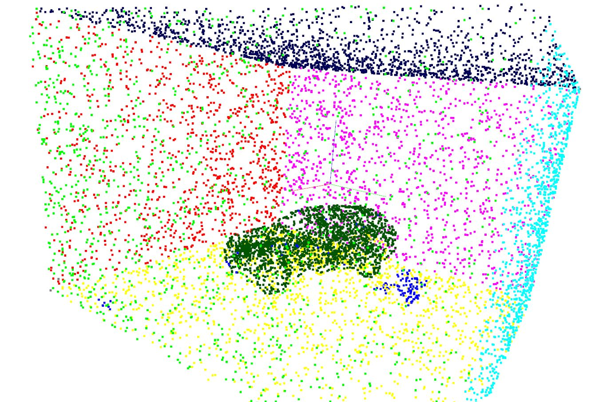
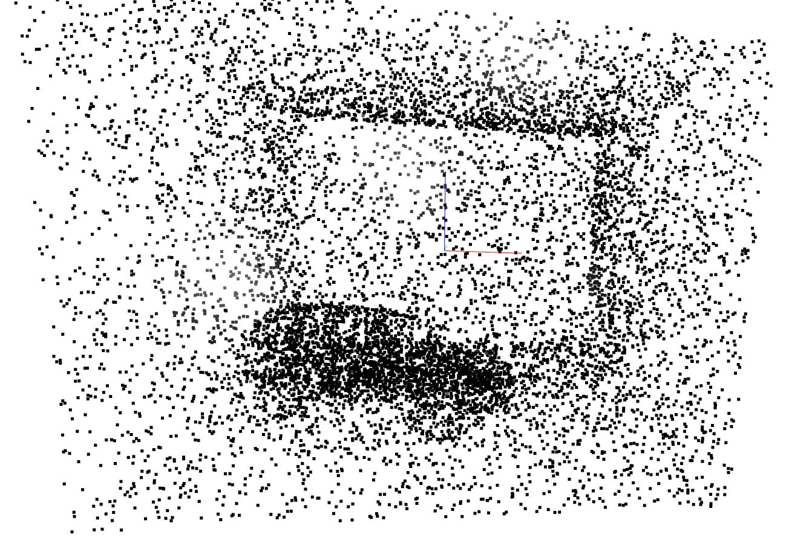
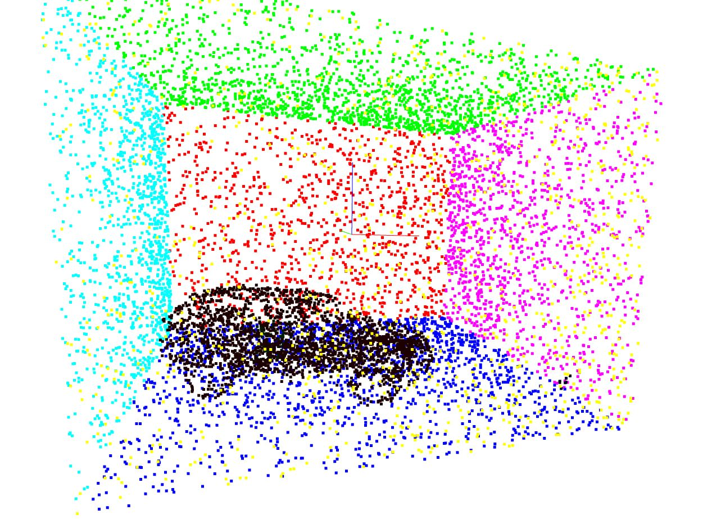
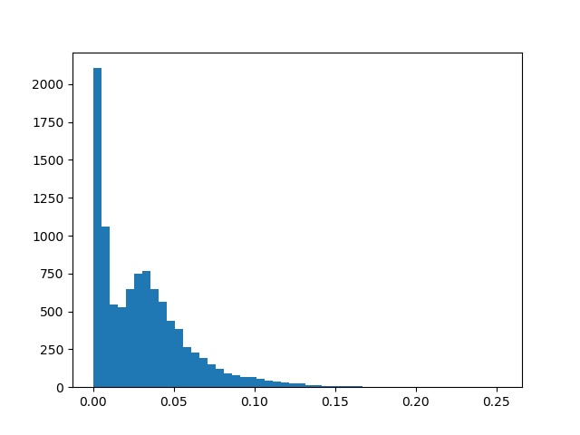
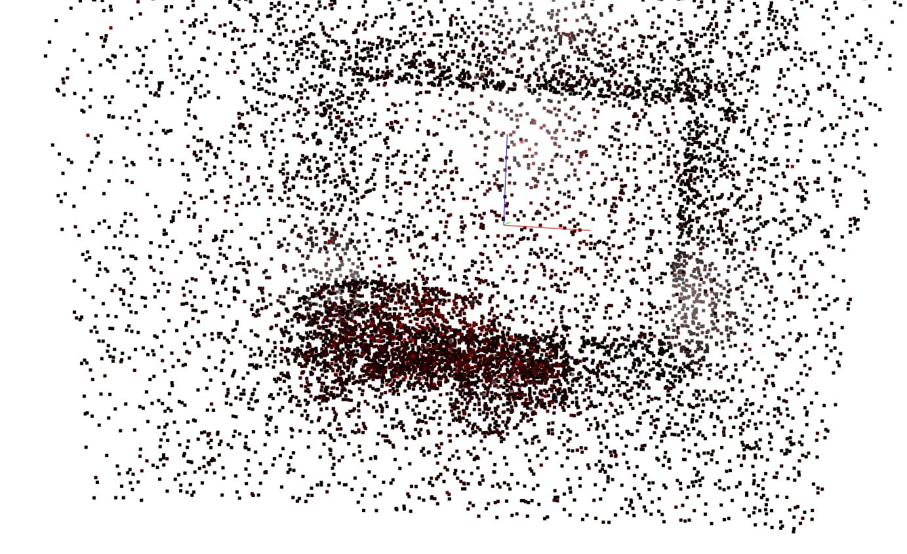

# Point Cloud Segmentation with Deep Reinforcement Learning

A documentation of the code and the parameters will be provided soon. Tested on Ubuntu 18.04.3 and Windows 10. 

## Requirements

A python interpreter of the version 3.6.8 is assumed. It is recommended to use [virtualenv](https://virtualenv.pypa.io/en/latest/) or a [conda environment](https://docs.conda.io/projects/conda/en/latest/user-guide/install/index.html). All requirements will be installed in the installation section. 

* [Segmentation Environment](https://github.com/mati3230/segmentation)
* [Stable-Baselines](https://github.com/mati3230/stable-baselines)
* [Pyntcloud](https://github.com/mati3230/pyntcloud)
* numpy
* scipy
* pandas
* matplotlib
* gym
* tensorflow-gpu==1.14 (tensorflow==1.14 without the usage of the GPU can also be used, Use tensorflow==1.5 if no AVX instructions are provided by your CPU)
	* CUDA and CUDNN has to be installed to use tensorflow-gpu. An installation guide can be found [here](https://www.tensorflow.org/install/gpu).

## Installation

### Ubuntu

The code is tested on Ubuntu 18.04.3.

1. *git clone https://github.com/mati3230/smartsegmentation.git*
2. *cd smartsegmentation*
3. execute the setup.sh script:

If a new CPU that provides AVX instructions and a CUDA capable GPU are available, use:

* *sh setup.sh*

If you just have no CUDA capable GPU in order to use tensorflow-gpu:

* *sh setup.sh tensorflow==1.14*

Otherwise, if you have an older CPU and without a GPU, use:

* *sh setup.sh tensorflow==1.5*

### Windows

The code is tested on Windows 10. 

1. Clone https://github.com/mati3230/smartsegmentation.git
2. Go to the new directory "smartsegmentation"
3. Clone https://github.com/mati3230/segmentation.git
4. Clone https://github.com/mati3230/stable-baselines.git
5. Go to the new directory *segmentation*
6. Clone https://github.com/mati3230/pyntcloud.git
7. Download the Open3D library from https://nextcloud.mirevi.medien.hs-duesseldorf.de/index.php/s/YYRNGZddRj9qaRX and store it in the *segmentation* directory
8. Unzip the files to a new folder in the *segmentation* directory called *o3d_0800_win_10*
  
  Your folder structure should be as follows:
  
  * smartsegmentation
    * segmentation
		* pyntcloud
		* o3d_0800_win_10
    * stable-baselines
		
9. Open a terminal (cmd, Anaconda Prompt) with your Python interpreter, navigate to the *segmentation* directory and install the contents in the *o3d_0800_win_10* folder with: *pip install ./o3d_0800_win_10*
10. Type *pip install -e ./pyntcloud* In your python terminal
11. Install the segmentation environment in your python terminal with *pip install -e .*
12. Download and install MPI for Windows: https://nextcloud.mirevi.medien.hs-duesseldorf.de/index.php/s/5MTjERWfc49KEyo
13. Download and install MPI SDK for Windows: https://nextcloud.mirevi.medien.hs-duesseldorf.de/index.php/s/qeEikozKiQqCCPd
14. In your python terminal, navigate one directory back into the *smartsegmentation* directory and install the *stable-baselines*: *pip install -e ./stable-baselines*
15. Install tensorflow in your python terminal: *pip install tensorflow-gpu==1.14*. If you have no CUDA capable GPU use: *pip install tensorflow==1.14*. If you have an old CPU that provides no AVX instructions and no GPU: *pip install tensorflow==1.5*. 
16. Type *pip install -r requirements.txt* In your python terminal

## Testing/Agent Segmentation

The segmentation of the agent and the result will be plotted. A trained policy is necessary. Policies are stored by default in the *./save_model/* directory. This directory can be changed with the *checkpoint_dir* parameter. The PointNet policy will be used by default.

*python agent_play.py*

The figure below shows a segmentation of the PointNet policy of the scene *PointcloudScenes/scene_0.csv* with a reward of 0.948/1. 

Similar to the training process, the policies can be changed with:

*python agent_play.py --policy=ldgcnn* or *python agent_play.py --policy=vox_custom --point_mode=Voxel*

## Training

*python train.py*

The different parameters can be printed with "python train.py -h". By default the PointNet policy will be used.
To use the LDGCNN policy enter:

*python train.py --policy=ldgcnn*

To use the voxel based policy enter:

*python train.py --policy=vox_custom --point_mode=Voxel*

The point cloud scenes should be placed in a folder called *PointcloudScenes*. The scenes have the naming convention *scene_x.csv* whereas x is a natural number. Hence, the first scene is *scene_0.csv*, the second scene *scene_1.csv* and so on. The scenes will be loaded in ascending order. The parameter *max_scenes* determine how many scenes will be loaded.

## Manual Segmentation

The segmentation can be executed manually with:

*python manual_play.py*

Every step, the sampled observation will be plotted. The query points will be plotted in grey. The parameters can be entered as in the following example to segment the ceiling: 

* Seed Point X: 0
* Seed Point Y: 0
* Seed Point Z: 3
* K: 12
* Angle Threshold: 20
* Curvature Threshold: 0.1

## Plot Point Clouds

To plot the point cloud scene 0 use: 

*python plot.py --file=PointcloudScenes/scene_0.csv*

To see the different labels enter: 

*python plot.py --file=PointcloudScenes/scene_0.csv --color_labels=True*

To plot the curvature values as histogram type: 

*python plot.py --file=PointcloudScenes/scene_0.csv --color_labels=True --curvature=True*

Moreover the point cloud with the curvature values will be plotted. The points with high curvature values will be plotted in red. 

## Generate Expert Trajectories

Currently, we have no success while creating expert trajectories. Thus, this module is experimental. However, expert trajectories can be generated by: 

*python expert_traj_generator.py*

A random agent will apply segmentations and trajectories with an appropriate reward will be saved which can be specified in the script. The available parameters are the same as for the training. Thus, the available parameters can be printed with the *-h* option. A *expert_trajectories.npz* file and a *pretrain* folder with the pretrain observations will be created. 
The expert trajectories can be used in the training by setting the *pretrain* flag to 1: 

*python train.py --pretrain=1*

The plot script *plot_trajectory.py* is also experimental and has to be extended. 
